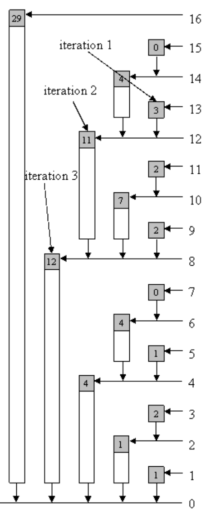

# LeetCode

My leetcode practices with complexity in comment.

---
# Notes

- [Manacher's Algorithm](#manachers-algorithm)
- [Kahn's Algorithm](#kahns-algorithm)
- [Knuth–Morris–Pratt Algorithm](#knuthmorrispratt-algorithm)
- [Newton's Method](#newtons-method)
- [Matrix multiplication with Cannon's Algorithm](#matrix-multiplication-with-cannons-algorithm)
- [Boyer–Moore's algorithms](#boyermoores-algorithms)
- [Binary Indexed Tree](#binary-indexed-tree)

## Manacher's Algorithm

Inspiration from: https://discuss.leetcode.com/topic/58568/java-o-n-solution

My implementation: 

```Java
// O(n) to find longest palindromic substring
public String longestPalindrome(String s) {
    if (s == null)  return "";
    
    // After addBoundary, chars_s is in the form: '#' '|' 's[0]' '|' 's[1]' '|' ... '|' '$'
    // The begin char '#' and end char '$' is for easy break the while loop inside without checking the boundaries 
    char[] chars_s = addBoundary(s.toCharArray());
    
    // This represented the length of the mirror when a palindromic string centered at index i
    int[] arr = new int[chars_s.length];
    int ctr = 0, r = 0, i;
        
    for (i = 1; i < chars_s.length - 1; i++) {
        // Case 2 in WIKI, when index is within the right range of previous palindrome
        // The new palindrome is guaranteed to have the length from its own center to the rightmost character of the previous one
        if (i < r) arr[i] = (r - i < arr[ctr * 2 - i]) ? r - i : arr[ctr * 2 - i];
            
        // Searching for true length of the mirror centered at i
        while(chars_s[i + (1 + arr[i])] == chars_s[i - (1 + arr[i])]) {
            arr[i]++;
        }
        // Check if needed to replace the previous palindrome with current palindrome
        if (i + arr[i] > r) {
            ctr = i; 
            r = i + arr[i];
        }
    }
    
    // The last part is quite easy. Just to find the palindrome with the longest distance centered the res_ctr.
    int max = 0, res_ctr = 0;
    for (i = 1; i < arr.length; i++) {
        if (arr[i] > max) {
            max = arr[i];
            res_ctr = i;
        }
    }
    
    // return the String centered at res_ctr with length max after deleting the '|'
    return getTargetString(chars_s, max, res_ctr);
}
    
public char[] addBoundary(char[] s) {
    char[] chars_s = new char[s.length * 2 + 3];
    chars_s[0] = '#';
    chars_s[chars_s.length - 1] = '$';
    for (int i = 0; i < s.length; i++) {
        chars_s[i * 2 + 1] = '|';
        chars_s[i * 2 + 2] = s[i];
    }
    chars_s[chars_s.length - 2] = '|';
    return chars_s;
}
    
public String getTargetString(char[] s, int len, int ctr) {
    char[] res = new char[len];
    int j = 0;
    for(int i = ctr - len + 1; i < ctr + len; i = i + 2) {
        res[j++] = s[i];
    }
    return new String(res);
}
```

Q: Why do we need to add splitters to the original string at first?

A: easy for even-length palindrome.

## Kahn's Algorithm

```Java
// O(n) to find if a set of task with prerequest of other task can be done
// [a, b] means b is the prerequest of a
public boolean canFinish(int numCourses, int[][] prerequisites) {
    HashMap<Integer, List<Integer>> map = new HashMap<Integer, List<Integer>>();
    Queue<Integer> queue = new LinkedList<>();
    int num = 0, i;
    int[] ins = new int[numCourses];;

    // mark the INs
    for (i = 0; i < prerequisites.length; i++) {
        int course = prerequisites[i][0];
        int pre = prerequisites[i][1];
        if (!map.containsKey(pre)) {
            map.put(pre, new ArrayList());
        }
        map.get((pre)).add(course);
        ins[course]++;
    }
    // add the course no INs to queue (which means they have no prerequisites)
    for (i = 0; i < numCourses; i++) {
        if (ins[i] == 0) {
            queue.add(i);
            num++;
        }
    }
    // decrease its children's INs and add the child to queue if its INs become 0 (which means its prerequisites are satisfied or deleted)
    while (!queue.isEmpty()) {
        int temp = queue.poll();
        if (map.containsKey(temp)) {
            for (Integer itg: map.get(temp)) {
                ins[itg] -= 1;
                if (ins[itg] == 0) {
                    queue.add(itg);
                    num++;
                }
            }
        }
    }
    // if visited number is the total number, then true, else false
    return num == numCourses;
}
```

## Knuth–Morris–Pratt Algorithm

```Java
// O(n + k) to find the occurrence of a string within another string
public int strStr(String haystack, String needle) {
    if(needle.length() == 0) return 0;
    // The table iter through string needle and decide if there is a matching prefix at each index
    int[] next = buildTable(needle);
    int i = 0, j = 0;
    while (i < haystack.length() && haystack.length() - i >= needle.length() - j){
        if (haystack.charAt(i) == needle.charAt(j)) {
            i++;
            j++;
        }
        else if (j == 0)
            i++;
        else {
            // here is the usage of the table: bring the index that had the prefix already instead of searching again
            j = next[j - 1];
        }
        if(j == needle.length()) return i - j;
    }
    return -1;
}
private int[] buildTable(String s){
    int[] next = new int[s.length()];
    next[0] = 0;
    for (int i = 1; i + 1 < s.length(); i++){
        if (s.charAt(i) == s.charAt(next[i-1])){
            next[i] = next[i-1] + 1;
        }
        else if (s.charAt(i) == s.charAt(0))
            next[i] = next[0] + 1;
        else next[i] = next[0];
    }
    return next;
}

/**The table is so smart.**/
```

## Newton's Method

Newton's Method can be used for finding root of a function.
It is faster than Binary search.

x_1 = x_0 - f (x_0) / f' (x_0)

```Java
// One way to do is to call the function for a fixed time such as 20, it will return a value that is approximated enough
 
// The other way is to set up a goal error
public int mySqrt(int x) {
    double x_d = (double)x;
    double res = (double)1;
    while (getError(x_d, res) > 1e-4) {
        res = res - (res * res - x_d) / (2 * res);
    }
    return (int)res;
}

public double getError(double x, double x_res) {
    if (x >= x_res * x_res)
        return x - x_res * x_res;
    else
        return x_res * x_res - x;
}
```

## Matrix multiplication with Cannon's Algorithm

Matrix Multiplication for matrix of n x n:
```
| A[0][0] A[0][1] A[0][2] |    | B[0][0] B[0][1] B[0][2] |    | C[0][0] C[0][1] C[0][2] |
| A[1][0] A[1][1] A[1][2] | = | B[1][0] B[1][1] B[1][2] | x | C[1][0] C[1][1] C[1][2] |
| A[2][0] A[2][1] A[2][2] |    | B[2][0] B[2][1] B[2][2] |    | C[2][0] C[2][1] C[2][2] |
               A               =               B                x                C
```
```Java
// O(n ^ 3)
for (int i = 0; i < n; i++) {
    for (int j = 0; j < n; j++) {
        for (int k = 0; k < n; k++) {
            A[i][j] += B[i][k] * C[k][j];
        }
    }
}
```

Cannon algorithm is an algorithm for matrix multiplication: For i-th row of matrix, circularly shift the row left by i elements, while for j-th column, circularly shift the column up by j elements.
   
```Java
// O(n3)
for (int i = 0; i < n; i++) {
    for (int j  0; j < n; j++) {
        A[i][j] += B[i][j] * C[i][j]
        shift row left by one element
        shift col up by one element
    }
}
```

Limitation:
    A must be an N x N matrix

For Non-square Matrix: A practical alternative - the SUMMA (Scalable Universal Matrix Multiplication Algorithm) Algorithm

    * The idea is to use outer product of a column of A with a row of B.

The SUMMA broadcast its value to all line according to the k.
The idea is to distribute the matrix to sub-matrix. 
```
| /__| __ |
| __ | __ |
```
```
| /_ -> _ |
| __ | __ |
```
```
| /__| /__|
  |
  v
| __ | __ |
```
```
| /__| /__|
| /__| __ |
```
As the previous, top right and bottom left broadcast to bottom right.
```
| /__| /__|
| /__| /__|
```
Later broadcast back.

## Boyer–Moore's algorithms

### Boyer–Moore string-search algorithm

Application: Pattern Search

Save a table of index of all sysbols. When search in the string contains the pattern, if there is a mismatch character, search it in the table and find the number of indexes to shift.

### Boyer–Moore majority vote algorithm

O(n) time and O(1) space.

For the elements exist more than floor of n/k times. This algorithm is actually O(kn) time and O(k) space. As k is constant, it is still O(n) time and O(1) space.

```Java
int[] candidates = new int[k-1];
int[] votes = new int[k-1];
for (int num: nums) {
    boolean hasMatch = false;
    for (int i = 0; i < candidates.length; i++) {
        if (candidates[i] == num) {
            votes[i]++;
            hasMatch = true;
            break;
        }
    }
    if (!hasMatch) {
        for (int i = 0; i < candidates.length; i++) {
            if (votes[i] == 0) {
                candidates[i] = num;
                votes[i]++;
                hasMatch = true;
                break;
            }
        }
    }
    if (!hasMatch) {
        for (int i = 0; i < votes.length; i++) {
            votes[i]--;
        }
    }
}

// Varifiy
for (int i = 0; i < votes.length; i++) {
    votes[i] = 0;
}
for (int num: nums) {
    for (int i = 0; i < candidates.length; i++) {
        if (num == candidates[i]) {
            votes[i]++;
            break;
        }
    }
}

for (int i = 0; i < candidates.length; i++) {
    if (votes[i] > nums.length / k)
        res.add(candidates[i]);
}
```

Note：Wiki mentioned that if there is no majority, it might give wrong output.

> However, if there is no majority, the algorithm will not detect that fact, and will still output one of the elements. A version of the algorithm that makes a second pass through the data can be used to verify that the element found in the first pass really is a majority.

This is the reason why there is a varification part.

## Binary Indexed Tree

Inspired by [davidtan1890](https://leetcode.com/problems/count-of-smaller-numbers-after-self/discuss/76718/7ms-Java-solution-using-Binary-Indexed-Tree). 

BIT implementation from [TopCoder](https://www.topcoder.com/thrive/articles/Binary%20Indexed%20Trees): [readCumulativeFrequency](https://www.topcoder.com/thrive/articles/Binary%20Indexed%20Trees#read) and [updateCumulativeFrequency](https://www.topcoder.com/thrive/articles/Binary%20Indexed%20Trees#add)

Top node is 0. For each node in **tree** at *idx*, it saves the cumulated frequcy for a certain range (**?** , idx) in **input array**.

Let *idx* = *0/1* * 2 ^ 0 + *0/1* * 2 ^ 1 + ... + *0/1* * 2 ^ *floor(log(idx))*. The range begins at the index that differs from the last non-zero coefficient.

For example:
- idx = 4 -> 1000. Flip the rightmost non-zero digit -> 0000. Hence, node 4 in tree saves (0, 4-1)=(0, 3) in input array.
- idx = 7 -> 1110. Flip the rightmost non-zero digit -> 1100. Hence, node 7 in tree saves (6, 7-1)=(6, 6) in input array.

An example of tree from [TopCoder](https://www.topcoder.com/thrive/articles/Binary%20Indexed%20Trees).


